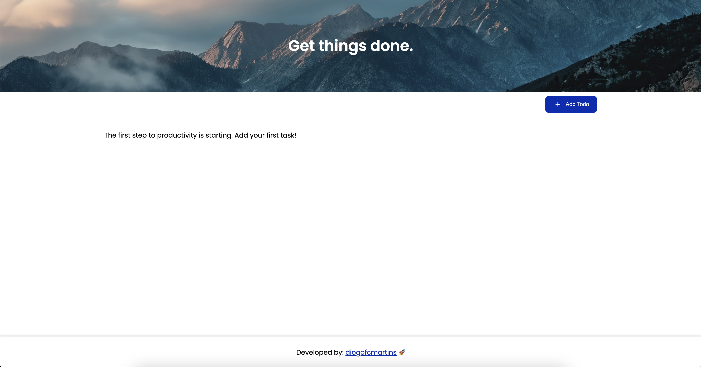

# 📝 Todo List App

A simple and efficient Todo List App built with React and TypeScript.

## 🚀 Features

- Add tasks with a title and description
- Mark tasks as done
- Edit and update tasks seamlessly
- Delete tasks you no longer need
- Persistent storage using LocalStorage
- User-friendly popup for adding and viewing task details

## 🛠️ Tech Stack

- React + TypeScript
- Luxon for date handling
- LocalStorage for data persistence
- React Icons for a sleek UI

 
 

## Preview

